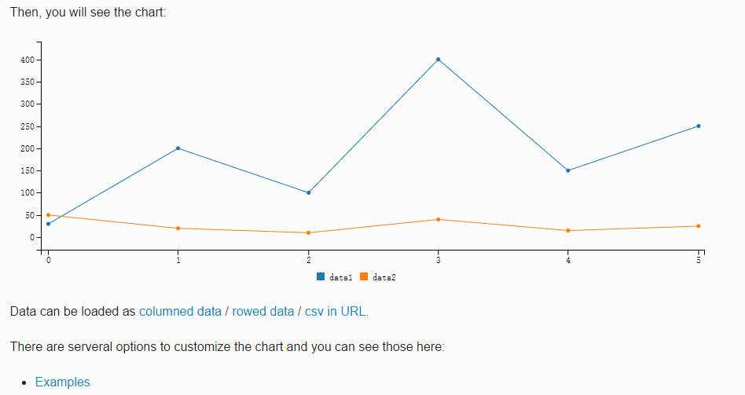

# C3

http://c3js.org/  
https://d3js.org/  

> C3.js D3-based reusable chart library  


## 开始使用  

http://c3js.org/gettingstarted.html  

1. Setup 设置   

https://github.com/c3js/c3/releases/tag/0.4.11   
https://github.com/d3/d3  


```codes
<!-- Load c3.css -->
<link href="/path/to/c3.css" rel="stylesheet" type="text/css">

<!-- Load d3.js and c3.js -->
<script src="/path/to/d3.v3.min.js" charset="utf-8"></script>
<script src="/path/to/c3.min.js"></script>
``` 

2. Generate Chart 生成图表   

```code
<div id="chart"></div>

``` 

```code
var chart = c3.generate({
    bindto: '#chart',
    data: {
      columns: [
        ['data1', 30, 200, 100, 400, 150, 250],
        ['data2', 50, 20, 10, 40, 15, 25]
      ]
    }
});
``` 


## examples 例子   
http://c3js.org/examples.html  

3. Customize Chart  

+ 1. Additional Axis 附加轴  

```codes
var chart = c3.generate({
    bindto: '#chart',
    data: {
      columns: [
        ['data1', 30, 200, 100, 400, 150, 250],
        ['data2', 50, 20, 10, 40, 15, 25]
      ],
      axes: {
        data2: 'y2' // ADD
      }
    },
    axis: {
      y2: {
        show: true // ADD
      }
    }
});
``` 


+ 2. Show Axis Label 显示轴标签  

```codes
var chart = c3.generate({
    bindto: '#chart',
    data: {
      columns: [
        ['data1', 30, 200, 100, 400, 150, 250],
        ['data2', 50, 20, 10, 40, 15, 25]
      ],
      axes: {
        data2: 'y2'
      }
    },
    axis: {
      y: {
        label: { // ADD
          text: 'Y Label',
          position: 'outer-middle'
        }
      },
      y2: {
        show: true,
        label: { // ADD
          text: 'Y2 Label',
          position: 'outer-middle'
        }
      }
    }
});
``` 


+ 3. Change Chart Type  更改图表类型  

```codes
var chart = c3.generate({
    bindto: '#chart',
    data: {
      columns: [
        ['data1', 30, 200, 100, 400, 150, 250],
        ['data2', 50, 20, 10, 40, 15, 25]
      ],
      axes: {
        data2: 'y2'
      },
      types: {
        data2: 'bar' // ADD
      }
    },
    axis: {
      y: {
        label: {
          text: 'Y Label',
          position: 'outer-middle'
        }
      },
      y2: {
        show: true,
        label: {
          text: 'Y2 Label',
          position: 'outer-middle'
        }
      }
    }
});
``` 


+ 4. Format values 格式化值  

```codes
var chart = c3.generate({
    bindto: '#chart',
    data: {
      columns: [
        ['data1', 30, 200, 100, 400, 150, 250],
        ['data2', 50, 20, 10, 40, 15, 25]
      ],
      axes: {
        data2: 'y2'
      },
      types: {
        data2: 'bar'
      }
    },
    axis: {
      y: {
        label: {
          text: 'Y Label',
          position: 'outer-middle'
        },
        tick: {
          format: d3.format("$,") // ADD
        }
      },
      y2: {
        show: true,
        label: {
          text: 'Y2 Label',
          position: 'outer-middle'
        }
      }
    }
});
``` 


4. Use APIs  

+ 1. Load Data 加载数据  

```codes
// var chart = c3.generate({ ... });

chart.load({
  columns: [
    ['data1', 300, 100, 250, 150, 300, 150, 500],
    ['data2', 100, 200, 150, 50, 100, 250]
  ]
});
``` 


+ 2. Unload Data 卸载数据  

```codes
// var chart = c3.generate({ ... });

chart.unload({
    ids: ['data2', 'data3']
});
``` 


+ 3. Show/Hide Data 显示/隐藏数据  

```codes
// var chart = c3.generate({ ... });

chart.hide(['data2', 'data3']);
chart.show(['data2', 'data3']);
``` 


5. Customize Style 自定义样式  

+ 1. Line style 线型  

```codes
#chart .c3-line-data2 {
  stroke-width: 5px;
}
``` 


ok


